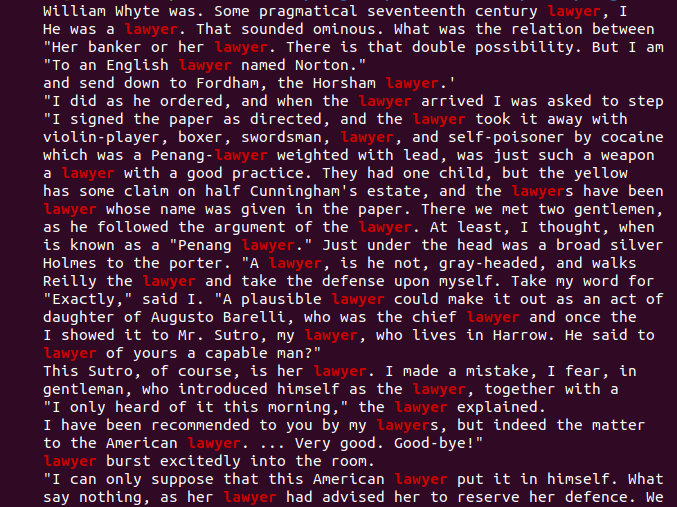
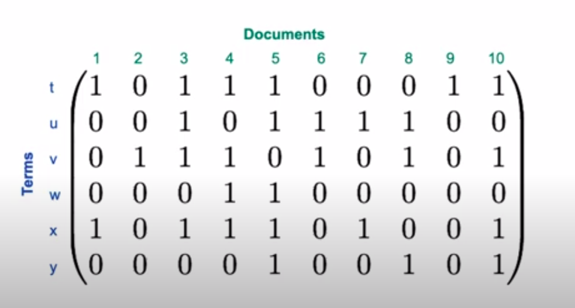

# Boolean Retrieval

Corpus: https://sherlock-holm.es/stories/plain-text/cano.txt

### Grepping

```bash
wget https://sherlock-holm.es/stories/plain-text/cano.txt -P ./docs/
```


**Query**: `lawyer`

```bash
grep lawyer cano.txt
```



**Query**: `lawyer AND Penang`

```bash
grep lawyer cano.txt | grep Penang
```


**Query**: `lawyer AND Penang AND NOT silver`

```bash
grep lawyer cano.txt | grep Penang | grep -v silver
```


**<u>Shortcomings</u>**:

- Only searches locally.
- Does not allow proximity search.
- Does not rank results.
- Linear complexity.


### Data model

Document

Term

Relationships:

- A term is <u>included</u> in a document: $t \in D$ $\rightarrow$ **Inclusion**

- A term can occur <u>x times</u> in a document: $\#(t, D) = x$ $\rightarrow$ **Occurrence**

- A term can occur <u>before</u> another: $t_1 < t_2$ $\rightarrow$ **Order**


Document as list of terms: :white_check_mark: Inclusion, :white_check_mark: Occurrence, :white_check_mark: Order

Document as bag of terms:  :white_check_mark: Inclusion, :white_check_mark: Occurrence, :x: Order 

Document as set of terms: :white_check_mark: Inclusion, :x: Occurrence, :x: Order 


**Incidence matrix**
$$
\textrm{contains}_{i,j} =
\begin{cases}
1 \quad \textrm{if document j contains term i} \\
0 \quad \textrm{if document j does not contain term i}
\end{cases}
$$
Document as a set of terms: we lose number of occurrences and order.

Function: $\textrm{contains} \in \mathbb{B}^{\textrm{Terms} \times \textrm{Documents}}$

- If we want the number of 0's and 1's: $2^{{\textrm{Terms} \times \textrm{Documents}}}$.




Boolean Query:

- $\neg\ \textrm{u}$ (NOT u): logical NOT of row u.
- $\textrm{u}\ \and\ \textrm{x}$ (u AND x): bitwise logical AND of rows u and x.
- $\textrm{u}\ \or\ \textrm{x}$ (u OR x): bitwise logical OR of rows u and x.
