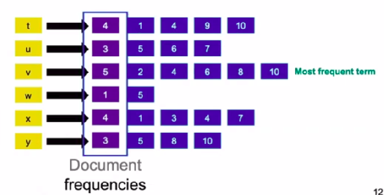

# Boolean Retrieval

Corpus: https://sherlock-holm.es/stories/plain-text/cano.txt

### Grepping

```bash
wget https://sherlock-holm.es/stories/plain-text/cano.txt -P ./docs/
```


**Query**: `lawyer`

```bash
grep lawyer cano.txt
```


**Query**: `lawyer AND Penang`

```bash
grep lawyer cano.txt | grep Penang
```


**Query**: `lawyer AND Penang AND NOT silver`

```bash
grep lawyer cano.txt | grep Penang | grep -v silver
```


**<u>Shortcomings</u>**:

- Only searches locally.
- Does not allow proximity search.
- Does not rank results.
- Linear complexity.


### Data model

Document

Term

Relationships:

- A term is <u>included</u> in a document: $t \in D$ $\rightarrow$ **Inclusion**

- A term can occur <u>x times</u> in a document: $\#(t, D) = x$ $\rightarrow$ **Occurrence**

- A term can occur <u>before</u> another: $t_1 < t_2$ $\rightarrow$ **Order**


Document as list of terms: :white_check_mark: Inclusion, :white_check_mark: Occurrence, :white_check_mark: Order

Document as bag of terms:  :white_check_mark: Inclusion, :white_check_mark: Occurrence, :x: Order 

Document as set of terms: :white_check_mark: Inclusion, :x: Occurrence, :x: Order 


**Incidence matrix**
$$
\textrm{contains}_{i,j} =
\begin{cases}
1 \quad \textrm{if document j contains term i} \\
0 \quad \textrm{if document j does not contain term i}
\end{cases}
$$
Document as a set of terms: we lose number of occurrences and order.

Function: $\textrm{contains} \in \mathbb{B}^{\textrm{Terms} \times \textrm{Documents}}$

- If we want the number of 0's and 1's: $2^{{\textrm{Terms} \times \textrm{Documents}}}$.


Boolean Query:

- $\neg\ \textrm{u}$ (NOT u): logical NOT of row u.
- $\textrm{u}\ \and\ \textrm{x}$ (u AND x): bitwise logical AND of rows u and x.
- $\textrm{u}\ \or\ \textrm{x}$ (u OR x): bitwise logical OR of rows u and x.

### Evaluation

Precision = $\displaystyle\frac{\textrm{relevant results}}{\textrm{all results}} = \displaystyle\frac{\textrm{true positives}}{\textrm{returned}}$.

Recall = $\displaystyle\frac{\textrm{relevant results}}{\textrm{all relevant documents}} = \displaystyle\frac{\textrm{true positives}}{\textrm{relevant}}$


Type I error: false positives (retrieved but not relevant)

- High precision $\rightarrow$ low type I error

Type II error: false negatives (relevant but not retrieved)

- High recall $\rightarrow$ low type II error

### Inverted indices

For each term, we list the document ids that feature it.


Term: each entry on the left side (t, u, v etc).

Dictionary: the set of terms.

Document: an entry with the same id on the right side (e.g., 4 for terms t, v, and x).

Posting: pair of term and document id, e.g., (x, 4).

Postings list: <u>sorted</u> list of postings for a term, e. g., for y, it is [5, 8, 10].


**Inverted index with document frequency**



AND query: intersection of postings lists

- t AND v: [4, 10]

OR query: union of postings lists 

- t OR v: [1, 2, 4, 6, 8, 9, 10]


**Intersection algorithm** (linear complexity):

1. Initialize two pointers at starting positions of (sorted) lists A and B.
2. IF value are the same, add value to intersection list and move both pointers to next position.
3. ELSE: move pointers of lower value to next.

**Union algorithm** (linear complexity):

1. Initialize two pointers at starting positions of (sorted) lists A and B.
2. Add smaller value and move its pointer to next (or both, if value is the same).


**Optimizing queries**:

- For AND queries, e.g., `eth AND zurich AND bibliopole`: sort by document frequency <u>on ascending order</u>.

- For OR queries, e.g., `epf OR eth`: we can approximate the size of resulting postings list by summing the two original lists.  

- For NOT queries, e.g. `NOT zurich`: adapt algorithm to "virtually" walk down negated list.


### Simple Boolean Language (EBNF)

For more on EBNF, see [this](https://en.wikipedia.org/wiki/Extended_Backus%E2%80%93Naur_form).


## This week's reading:

Chapter 1: Boolean retrieval

Manning, C. D. (2008). *Introduction to information retrieval*. Syngress Publishing,.
