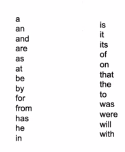
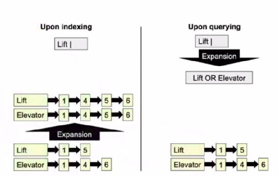
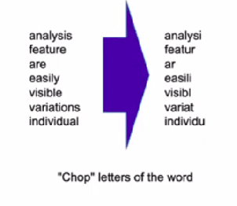
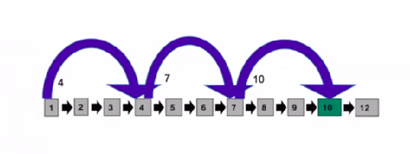

# Term Vocabulary

**Collecting documents**

First challenge: Encoding: ASCII? Latin-1? UTF-8?

Second challenge: Fine-grained documents (e.g. email archive)

**Type**: terms of equivalent class. E.g.:

- Is, am, are, be.
- Window, windows.
- USA, U.S.A.

**Stopwords** (Reuter's list):

### Expansion

### Stemming

**Algorithms**:

- [Porter stemmer](https://tartarus.org/martin/PorterStemmer/)
- [Lovins stemmer](http://snowball.tartarus.org/algorithms/lovins/stemmer.html)
- [Paice stemmer](https://dl.acm.org/doi/pdf/10.1145/101306.101310)

***

### Skip lists

Rule of thumb: skip size $\rightarrow$ square root of size.

### Phrase search (with quotes): approaches

Biword indices: Add 2-grams to list of terms

- Size of vocabulary increases exponentially.

Positional indices: add list of offsets where terms appear in document to the postings lists. 

- Model goes from <u>sets</u> of words to <u>lists</u> of words (+ order).

***

## This week's reading:

Chapter 2: The Term Vocabulary and Postings Lists

Manning, C. D. (2008). *Introduction to information retrieval*. Syngress Publishing,.