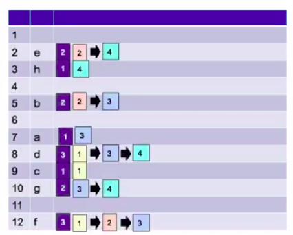
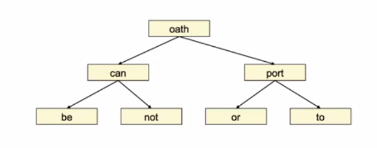
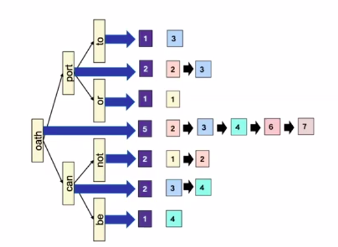

# Tolerant Retrieval

### Searching on a postings list

**Solution 1: hash table**

Limitations:

- No support for  range queries: `a-c?`.
- Hash function not perfect in real life.
- Space requirements for collision avoidance.

**Solution 2: binary tree**

Binary search tree:

With postings:

Alternative: postings only on leaves:

