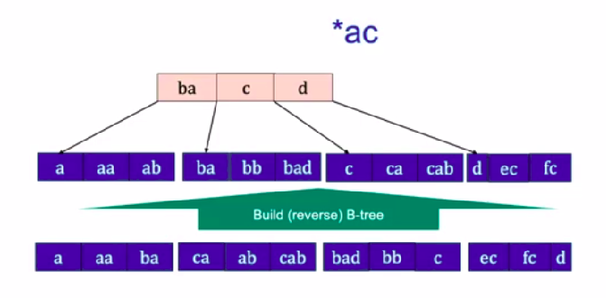
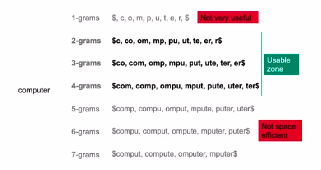

# Tolerant Retrieval

### Searching on a postings list

**Solution 1: hash table**

Limitations:

- No support for  range queries: `a-c?`.
- Hash function not perfect in real life.
- Space requirements for collision avoidance.

**Solution 2: binary tree**

Binary search tree:

With postings:

Alternative: postings only on leaves:

Design choice: [)-intervals

**Solution 3: B+ tree**

- All leaves at same depth.
- All non-leaf nodes have between 3 and 5 children. (But it's fine if the root has less.)
- Actual terms (and postings lists) only at the leaves. (Keys in grey only for comparison purposes.) -> Hence, the plus.

B+ trees often have extra leaf pointers:

General case: number of children between $d+1$ and $2d+1$, $d \geq 1$.

- It means, the number of keys is between $d$ and $2d$.

More on B-Trees [here](https://www.tutorialspoint.com/data_structures_algorithms/b_trees.htm) and [here](https://www.cs.usfca.edu/~galles/visualization/BTree.html).

### Wildcards

Tailing wildcard (easier):

Leading wildcard:

    
    
    

Single-wildcard query:

`Zu*ch` $\rightarrow$ `Zu*` AND `*ch`.

<u>There might be false positives!</u>

### Permuterm index

### K-grams

Multiple wildcards: `*mpu*`

K-gram index:

    
    

### Spelling correction

Levenshtein distance:

It is not feasible to calculate edit distance between one query and all terms.

- Solution: pre-select a few terms.

- Assumption: two terms within a small edit distance have man k-grams in common.

We need a normalization factor, for words which due to their length might have many k-grams in common even though not being close to each other.

- Cardinality of intersection divided by cardinality of union $\rightarrow$ [Jaccard Coefficient](https://en.wikipedia.org/wiki/Jaccard_index).

**Updated method**:

1. Get k-grams from the query term;
2. Look them up in the k-gram index;
3. Compute Jaccard coefficients;
4. Keep terms within large Jaccard coefficients.

<u>Resource issue</u>: We would need to extract k-grams from *every term* found in the k-gram index, compute the intersection and union, and then the Jaccard coefficients.

<u>Shortcut</u>:

- Numerator: We *already know* the k-grams that the query term and the found term have in common.
- Denominator: can be calculated with just the *found term's length*.
  - Number of query term's k-grams $+$ number of found term's k-grams - cardinality of intersection (numerator).
  - $J(\textrm{computer}, \textrm{cmputer}) = \displaystyle\frac{5}{7 + 8 - 5} = \frac{1}{2}$.

**Final method**:

1. Get k-grams from the query term;
2. Look them up in the k-gram index;
3. Compute *edit* distances;
4. Keep terms within small *edit* distances.

***

### Phonetic correction

[SoundEx algorithm](https://physics.nist.gov/cuu/Reference/soundex.html): every word $\rightarrow$ 4 characters fingerprint.

**Steps**:

1. Replace letters (except the first one) for the integer in the previous table.
2. Remove adjacent duplicates.
3. Remove the zeros.
4. Left-pad (with zeros) or trim to (first) four digits.

**Examples**:

***

## This week's reading

Chapter 3: Dictionaries and Tolerant Retrieval

Manning, C. D. (2008). *Introduction to information retrieval*. Syngress Publishing,.