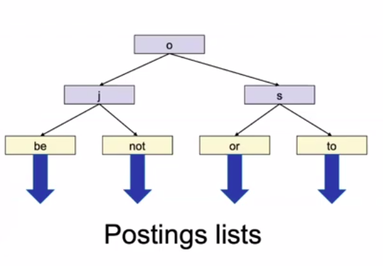

# Tolerant Retrieval

### Searching on a postings list

**Solution 1: hash table**

Limitations:

- No support for  range queries: `a-c?`.
- Hash function not perfect in real life.
- Space requirements for collision avoidance.

**Solution 2: binary tree**

Binary search tree:

With postings:

Alternative: postings only on leaves:

Design choice: [)-intervals

**Solution 3: B+ tree**

- All leaves at same depth.
- All non-leaf nodes have between 3 and 5 children. (But it's fine if the root has less.)
- Actual terms (and postings lists) only at the leaves. (Keys in grey only for comparison purposes.) -> Hence, the plus.

B+ trees often have extra leaf pointers:

General case: number of children between $d+1$ and $2d+1$, $d \geq 1$.

- It means, the number of keys is between $d$ and $2d$.

More on B-Trees [here](https://www.tutorialspoint.com/data_structures_algorithms/b_trees.htm) and [here](https://www.cs.usfca.edu/~galles/visualization/BTree.html).

### Wildcards

Tailing wildcard (easier):

Leading wildcard:

    
    
    

Single-wildcard query:

`Zu*ch` $\rightarrow$ `Zu*` AND `*ch`.

<u>There might be false positives!</u>

### Permuterm index

