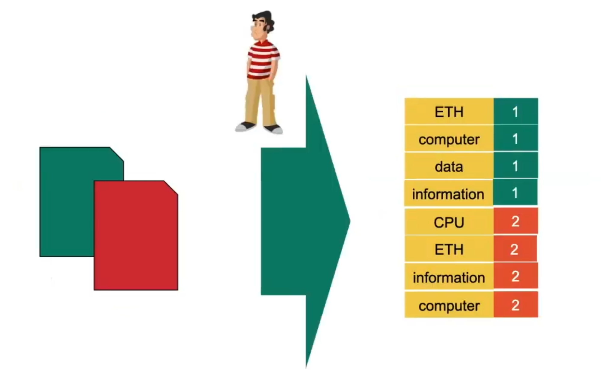
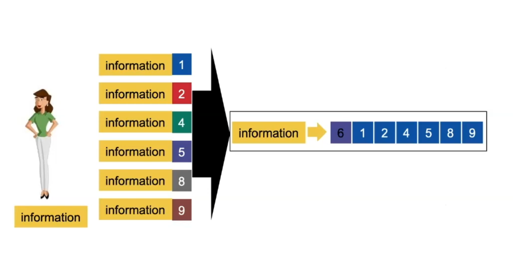
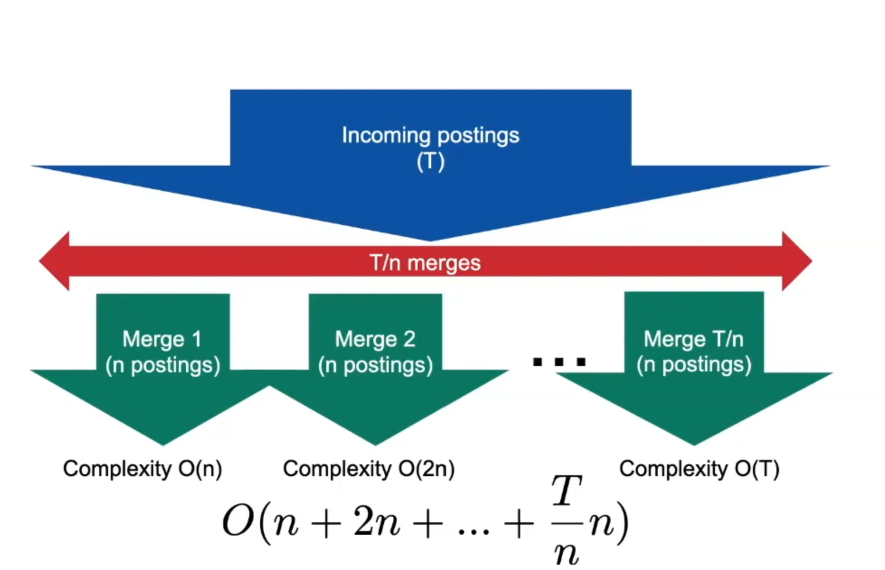
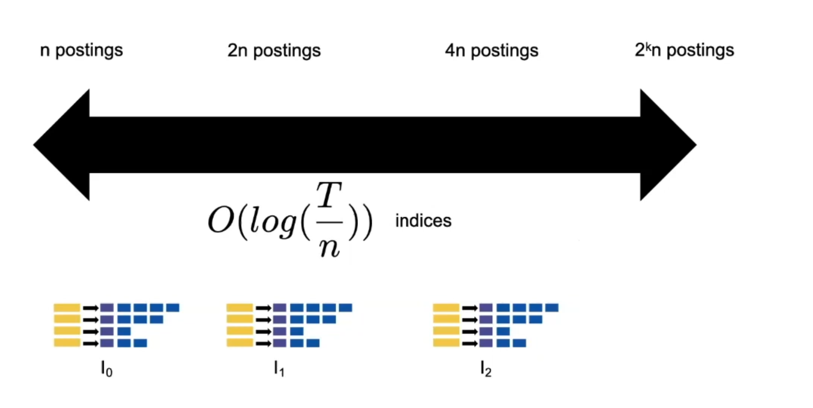

# Index Construction

## Blocked Sort-Based Indexing (BSBI)

- Divided huge collections into batches.
- Process batches one by one in memory.
    - Parse and read termID-docID pairs into memory.
    - Generate termIDs:
        - Strategy 1: Do a first pass to build term-termID mapping.
        - Strategy 2: On the fly.
    - Sort termID-docID pairs (by docID then termID).
    - Write pairs back to disk (term-termID mapping stays in memory).
- Write back to disk intermediate results.
- Merge intermediate results into final index ([traversal](https://www.geeksforgeeks.org/tree-traversals-inorder-preorder-and-postorder/)).

Complexity:
- First step (processing): $\mathcal{O}(T\log{}T)$.
- Second step (merging): $\mathcal{O}(T)$.
- Ultimately: $\mathcal{O}(T\log{}T)$.

More [here](https://nlp.stanford.edu/IR-book/html/htmledition/blocked-sort-based-indexing-1.html).

## Single-Pass In-Memory Indexing (SPIMI)

- When processing batches, it already starts building a standard inverted index (instead of only termID-docId pairs).
- It stores the terms in the index (instead of termIDs): no term-termID mapping held in memory.
- In the final merge, "proto" standard inverted index are merged (instead of termID-docId pairs)

Complexity:
- First step (processing): $\mathcal{O}(T\log{}M)$.
- Second step (merging): $\mathcal{O}(T)$.
- Ultimately: $\mathcal{O}(T)$.

More [here](https://nlp.stanford.edu/IR-book/html/htmledition/single-pass-in-memory-indexing-1.html).

## MapReduce

Task 1: Mapping
- The set of all Pokémon is distributed among, say, 10 people, to be counted.

Task 2: Reducing
- Each person is responsible for consolidating the number of a different Pokémon.

More [here](https://www.databricks.com/br/glossary/mapreduce).

### Building an index with MapReduce

**Mappers**: Take the batch of documents and process it to create a list of term-docID pairs.

**Reducers**: Take one term each and consolidate all respective pairs into an entry in the standard inverted index.

## Online Index Construction

**First approach**: periodic reconstruction

- Result staleness
- Potentially, unavailable, or slower, during index construction

**Solution**: auxiliary index

- Main index in disk, auxiliary index (with new entries) in memory.
- For each query, two lookups are necessary.
- Merge when auxiliary index is too large (say, every two days).

*Deletion of a document*

Invalidation bit vector:
- List of pairs of docId and a bit indicating whether the document has been deleted.
- Invalidated documents get filtered out when returning query results.

More [here](https://nlp.stanford.edu/IR-book/html/htmledition/dynamic-indexing-1.html).

### Complexity analysis

**Linear merging**

Simplifying, $\mathcal{O}(n + 2n + ... + \frac{T}{n}n) = \mathcal{O}(\frac{T^2}{n})$.

**Solution**: Logarithmic merging.

Construction time: $\mathcal{O}(T\log\frac{T}{n})$.

More on <u>Log-Structured Merge Trees</u> [here](https://www.cs.umb.edu/~poneil/lsmtree.pdf).

## This week's reading

Chapter 4: Index construction

Manning, C. D. (2008). *Introduction to information retrieval*. Syngress Publishing,.