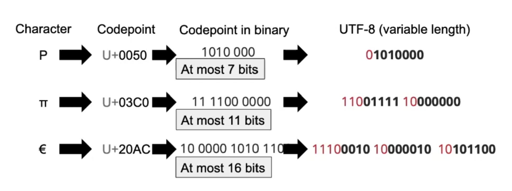
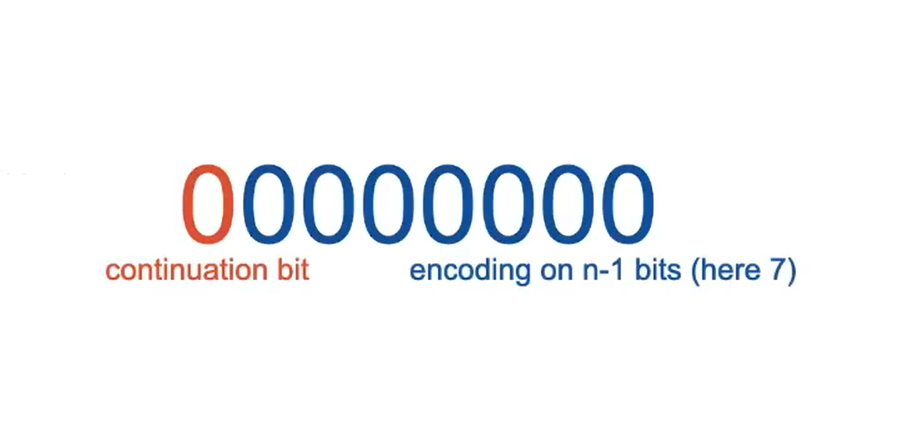
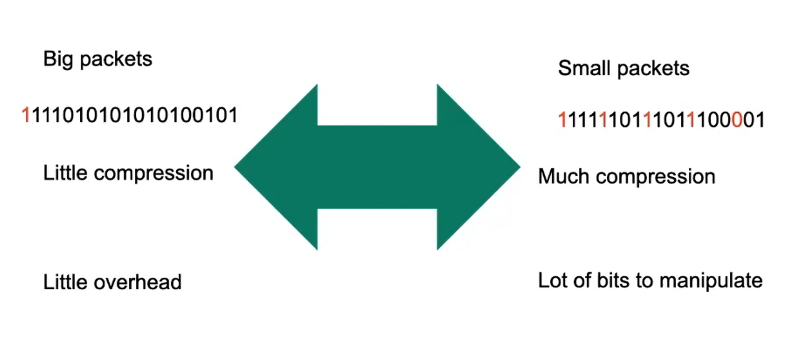
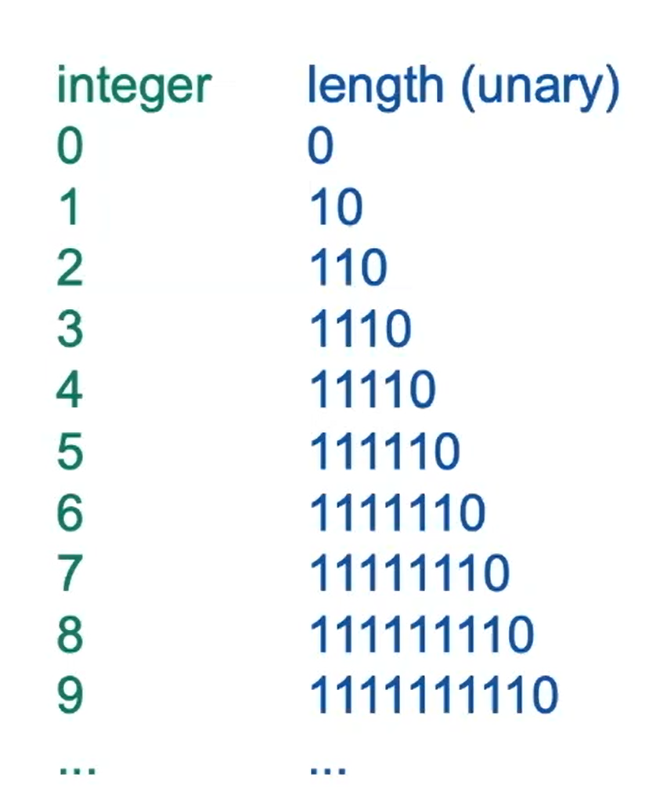
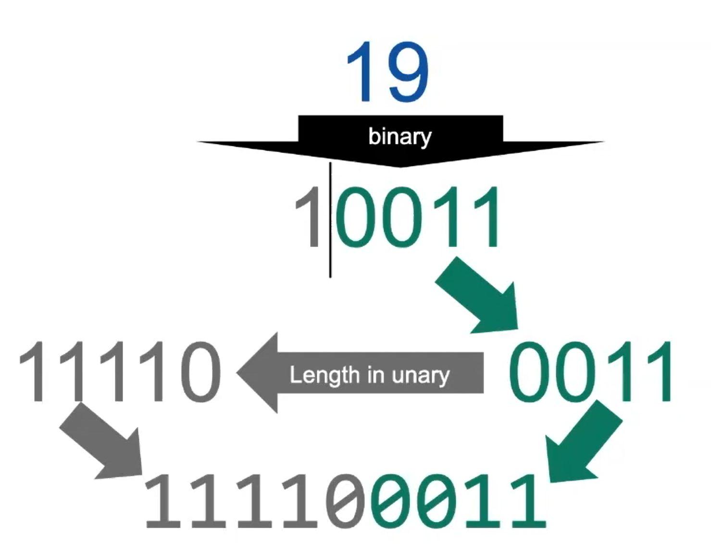
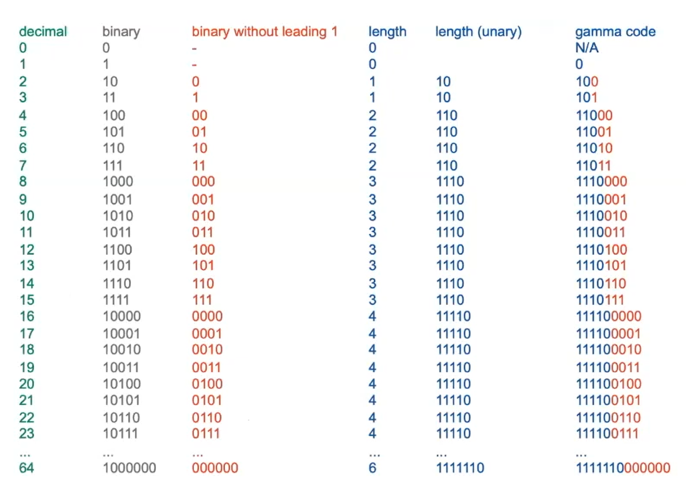

# Index Compression

Notations used in book
- N: number of documents
- T: number of tokens (positional postings)
- M: number of terms (or types, if stemming/lemmtaization)

**Heap's law**

The number of terms (height of index) grows in the square root of number of tokens in collection.

**Zipf's law**

The frequency of terms is inversely proportional to their rank.

### Dictionary compression

Status quo: dictionary (list of terms) as a B+ tree.

**Approach 1**: Array

<u>Issue</u>: terms might exceed 20 bytes.

**Approach 2**: String

**Approach 3**: Blocked Storage

**Approach 4**: Front coding

### Postings compression

In other words, we want to compress lists of integers.

**Naive approach**: fixed blocks of 4 bytes per integer -> lots of space still.

**Encoding gaps**:

### Variable Byte Encoding

Prefix codes: UTF-8

Variable byte encoding (8 bit packets)

Compromise:

### Gamma encoding

Unary code

Gamma encoding

First integers:

More on Gamma encoding [here](https://www.geeksforgeeks.org/elias-gamma-encoding-in-python/).

### Shannon Entropy

Given some probability distribution, what is the *smallest average* number of bits that we can possibly achieve?

**Entropy**:

$$
H(X) = \mathbb{E}\big[I(X)\big] = -\sum_{x \in X(\Omega)} p_X(x) \log_{2} p_X(x)
$$

- $X$: random variable
- $I(X)$: amount of information (number of bits)
- $H(X)$: entropy, or the expected value of the amount of information that is carried by $X$.

Shannon's suggestion: $H(X) = \mathbb{E}\bigg[-\log_{2}\big(p_X(X)\big)\bigg]$

**Expected length of Gamma encoding (for any distribution)**:

$$
\mathbb{E}[L_{\gamma}(X)] \leq 3H(X) = 3\mathbb{E}[I(X)]
$$