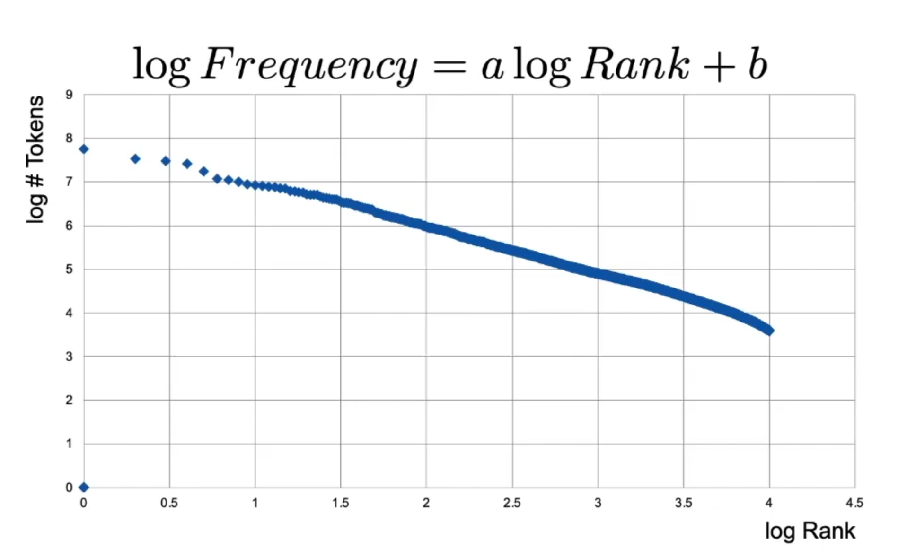

# Index Compression

Notations used in book
- N: number of documents
- T: number of tokens (positional postings)
- M: number of terms (or types, if stemming/lemmtaization)

**Heap's law**

The number of terms (height of index) grows in the square root of number of tokens in collection.

**Zipf's law**

The frequency of terms is inversely proportional to their rank.

### Dictionary compression

Status quo: dictionary (list of terms) as a B+ tree.

**Approach 1**: Array

<u>Issue</u>: terms might exceed 20 bytes.

**Approach 2**: String

**Approach 3**: Blocked Storage

**Approach 4**: Front coding

### Postings compression

In other words, we want to compress lists of integers.

**Naive approach**: fixed blocks of 4 bytes per integer -> lots of space still.

**Encoding gaps**:

